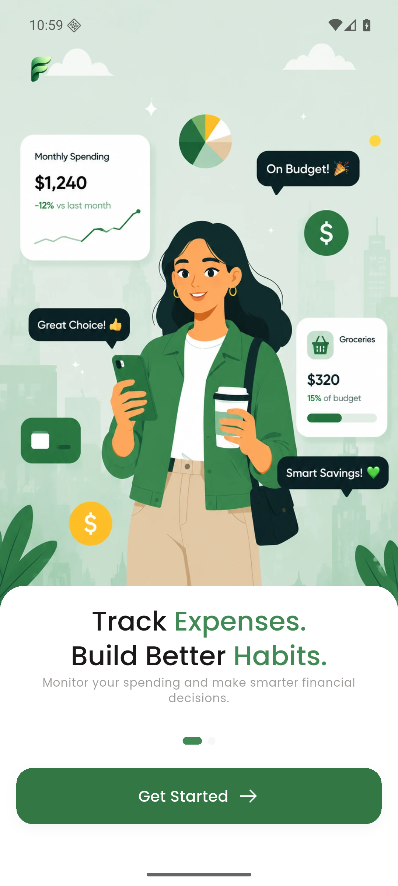
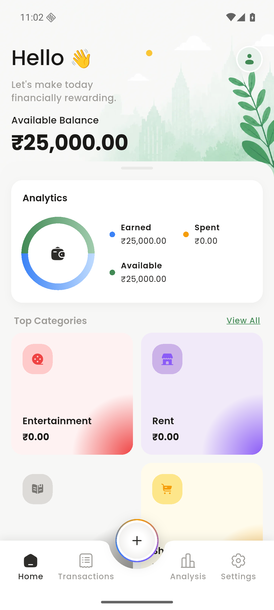
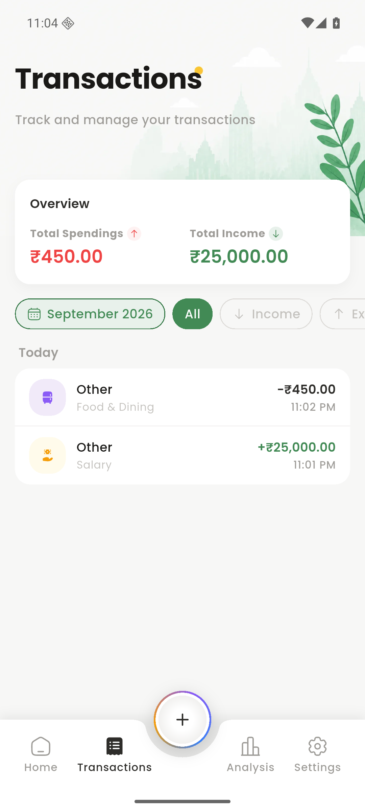
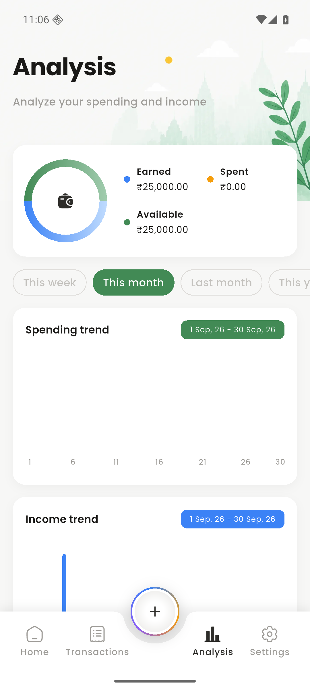
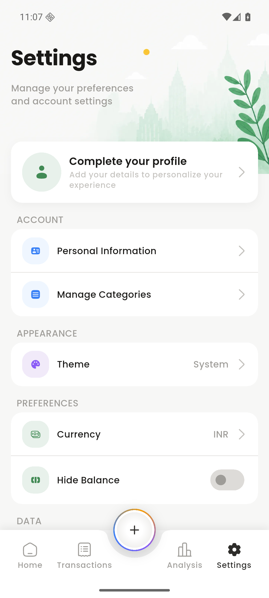
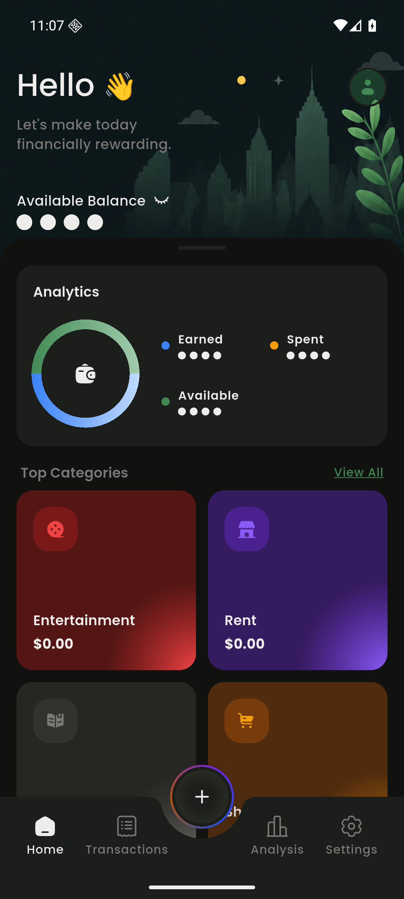

# FinPal 💰

FinPal is a personal finance tracker that keeps your money data where it belongs — on your phone. Log income and expenses, organise them your way, and see where your money goes. No account, no ads, no analysis, and **no `INTERNET` permission in the release build**.

<p align="center">
  <a href="https://flutter.dev"></a>
  <a href="https://dart.dev"></a>
  <a href="https://riverpod.dev"></a>
  
  <a href="https://github.com/shubham24680/FinPal/releases/latest"></a>
</p>

---

## Table of Contents

- [Download](#-download)
- [Screenshots](#-screenshots)
- [Features](#-features)
- [Privacy & Data](#-privacy--data)
- [Tech Stack](#-tech-stack)
- [Project Structure](#-project-structure)
- [Getting Started](#-getting-started)
- [Legal](#-legal)
- [Roadmap](#-roadmap)
- [Contributing](#-contributing)

---

## 📲 Download

Download the latest Android APK from the releases page:

[](https://github.com/shubham24680/FinPal/releases/latest)

> **Play Store:** v1.0.0 is built and signed. The Play listing is in closed testing — Google requires a 14-day test with 12+ testers before a personal developer account can publish to production.

FinPal targets **Android**. The iOS, macOS, web, Windows, and Linux project folders are generated by Flutter but are not supported or tested.

---

## 📸 Screenshots

<p align="center">
  
  
  
  
  
  
</p>

---

## 🚀 Features

### Tracking

- **Income & expenses** — Amount, date, category, payment method, and an optional note.
- **Receipt photos** — Attach a photo from the camera or gallery to any transaction. The image is copied into FinPal's private storage so it survives the system clearing your cache.
- **Swipe actions** — Swipe a transaction to edit or delete it.
- **History** — Records grouped by month and day, filterable by income or expense.

### Analysis

- **Category breakdown** — Pie chart of where the money went, with amounts and share of total.
- **Trends** — Income and expense movement over the selected period.
- **Periods** — This week, this month, last month, and this year.
- **Category drill-down** — Open any category to see its transactions, its trend, and which payment methods it came from.
- **Payment method rollup** — Totals per method, so you can see how much actually goes out through UPI, cash, or card.

### Personalisation

- **Custom categories** — Build your own income and expense categories with an icon and colour.
- **Payment methods** — Add and organise UPI, cash, cards, or anything else.
- **Profile** — Display name, avatar, date of birth, gender, and monthly income, with a completion prompt that nudges you through setup.
- **Theme** — Light, dark, or follow the system.
- **Currency** — INR or USD.
- **Hide balance** — Blur your balance on the home screen when you are in public.

### Data

- **Clear data** — Wipe everything from the device in one action, receipts included.
- **Orphan cleanup** — Receipt and avatar files with no matching record are swept at startup, so deleted images do not linger in storage.

---

## 🔒 Privacy & Data

FinPal is **local-first, enforced by the binary rather than by a promise.**

The release manifest declares **no `INTERNET` permission**. Your records physically cannot leave the device, because the app has no way to send them. `INTERNET` is present only in the debug and profile manifests, where Flutter needs it for the VM service.

| Data | Where it lives |
| --- | --- |
| Transactions, categories, payment methods, settings | On-device (Hive) |
| Receipt images and avatars | On-device (app-private storage) |

The release build requests three permissions, all for attaching images and all asked for at the moment you tap:

| Permission | Why | When |
| --- | --- | --- |
| `CAMERA` | Take a receipt photo or profile picture | On tap, only if you choose Camera |
| `READ_MEDIA_IMAGES` | Pick an existing image (Android 13+) | On tap, only if you choose Gallery |
| `READ_EXTERNAL_STORAGE` | Same, on Android 12 and below (`maxSdkVersion="32"`) | On tap, only if you choose Gallery |

Denying them only disables image attachment; everything else keeps working. Selected images are copied into app-private storage and are never uploaded.

- No account or sign-up
- No bank login and no credential collection
- No ads, no analysis, no crash reporting, no tracking
- No location, contacts, SMS, or notification access
- Clearing app data or uninstalling removes your records from the device

Because nothing is uploaded, **there is no cloud backup**. If you lose the device or clear the data, the records are gone.

See the hosted [Privacy Policy](https://shubham24680.github.io/policy/finpal-privacy-policy.html) and [Terms & Conditions](https://shubham24680.github.io/policy/finpal-terms-and-conditions.html). Source copies live in `docs/`.

---

## 🛠 Tech Stack

| Layer | Tools |
| --- | --- |
| **Framework** | [Flutter](https://flutter.dev) |
| **State management** | [Riverpod](https://riverpod.dev) |
| **Local database** | [Hive](https://docs.hivedb.dev/) |
| **Routing** | [GoRouter](https://pub.dev/packages/go_router) |
| **Charts** | [fl_chart](https://pub.dev/packages/fl_chart) |
| **UI** | `flutter_screenutil`, `flutter_svg`, `flutter_native_splash`, `shimmer`, `smooth_page_indicator` |
| **Other** | `image_picker`, `permission_handler`, `path_provider`, `url_launcher`, `uuid`, `intl`, `package_info_plus` |

---

## 📂 Project Structure

```text
lib/
├── main.dart               # Entry point and root widget
├── app/                    # Barrel exports and startup initialiser
├── core/
│   ├── common/             # Bottom sheets, responsive builder
│   ├── constants/          # Colours, images, SVGs, app constants
│   ├── customs/            # Buttons, dialogs, chips, text fields, typography
│   ├── extensions/         # DateTime, string, padding, gesture, context helpers
│   ├── local_storage/      # Hive boxes and initialisation
│   ├── packages/           # Third-party barrel exports
│   ├── routes/             # GoRouter configuration
│   ├── theme/              # Light and dark themes
│   └── utils/              # Image storage, formatters, helpers
└── features/
    ├── onboarding/         # Splash, intro, personal details
    ├── home/               # Shell, bottom navigation, balance card
    ├── transaction/        # Add, edit, list, receipts
    ├── analysis/           # Charts, periods, category drill-down
    └── settings/           # Profile, categories, methods, theme, currency, legal

docs/
├── PRD.md                          # Product requirements and roadmap
├── finpal-privacy-policy.html
└── finpal-terms-and-conditions.html

store/                      # Play Console assets (not bundled into the app)
├── README.md               # Listing copy and Play Console checklist
├── screenshots/
├── play_icon_512.png
└── feature_graphic_1024x500.png

test/                       # Unit and widget tests
```

Each feature follows the same split: `data/` holds models, services, constants, and Riverpod notifiers; `presentation/` holds screens and widgets.

---

## 🏗 Getting Started

### Prerequisites

- [Flutter SDK](https://docs.flutter.dev/get-started/install) 3.x
- Dart `^3.7.2`
- Android Studio or VS Code with the Flutter extension
- A device or emulator running **Android 5.0 (API 21)** or newer

> On Apple Silicon, install the **arm64** Flutter SDK. The x64 build runs under Rosetta and crashes on recent macOS versions.

### Setup

1. **Clone the repository**

   ```bash
   git clone https://github.com/shubham24680/FinPal.git
   cd FinPal
   ```

2. **Install dependencies**

   ```bash
   flutter pub get
   ```

3. **Generate Hive adapters**

   ```bash
   dart run build_runner build --delete-conflicting-outputs
   ```

4. **Run the app**

   ```bash
   flutter run
   ```

### Analyse and test

```bash
flutter analyze
flutter test
```

### Release builds

Release builds are signed and require a keystore. Create `android/key.properties`:

```properties
storeFile=/absolute/path/to/upload-keystore.jks
storePassword=...
keyPassword=...
keyAlias=upload
```

The Gradle config **fails the build loudly** if this file is missing, rather than silently falling back to debug signing.

```bash
flutter build appbundle --release   # build/app/outputs/bundle/release/app-release.aab
flutter build apk --release         # build/app/outputs/flutter-apk/app-release.apk
```

| Setting | Value |
| --- | --- |
| Application ID | `com.seven.finpal` |
| compileSdk / targetSdk | 36 |
| minSdk | 21 |
| Version | `1.0.0+1` |

---

## 📄 Legal

Hosted on GitHub Pages, with source copies in `docs/`:

- [Privacy Policy](https://shubham24680.github.io/policy/finpal-privacy-policy.html)
- [Terms & Conditions](https://shubham24680.github.io/policy/finpal-terms-and-conditions.html)

In-app links live in `lib/features/settings/data/constants/settings_constant.dart`.

The source is published for transparency and review. There is no open-source licence file, so all rights are reserved as described in section 7 of the Terms and Conditions. You are welcome to read the code, fork it on GitHub, and open pull requests; redistributing FinPal or a derived app needs written permission.

---

## 📋 Roadmap

The full product plan — versions, user stories, acceptance criteria, schema
migrations, and risks — is in **[`docs/PRD.md`](docs/PRD.md)**.

**v1.1 — Complete the Core** *(offline)* — budgets, recurring, export, search, app lock, multi-currency, reminder, widget

**v1.2 — Effortless Capture** *(on-device)* — notification/SMS review queue, receipt OCR, smart categorisation

**v1.3 — Command Your Money** *(offline)* — account balances, bills & EMIs, savings goals, cash-flow calendar, net worth lite

**v2.0 — Connected** *(opt-in)* — optional account, E2E sync, FinPal Pro

**v2.1 — Shared** *(opt-in)* — Splitwise-class groups that write your share into your budget

**v2.5 — Copilot** *(opt-in)* — AI spending analysis, natural-language query, AI news digest

**v3.0 — Learn** *(opt-in, gated)* — shorts / reels / creator video; cancelled if Stage 1 cards are ignored

Networked releases keep local-first as the default. See
[the PRD](docs/PRD.md) for user stories, acceptance criteria, schema, and risks.

---

## 🤝 Contributing

Contributions are welcome.

1. Fork the repository
2. Create a feature branch (`git checkout -b feature/my-feature`)
3. Make sure `flutter analyze` and `flutter test` pass
4. Open a pull request against `main`

Keep changes focused and follow the existing `data/` and `presentation/` split inside each feature.

**One hard rule:** do not add a dependency or a permission that sends data off the device without discussing it first. The release build has no `INTERNET` permission, and that is the product.

---

Made with ❤️ by [Shubham Patel](https://github.com/shubham24680)
