# FinPal — Product Requirements Document

| | |
| --- | --- |
| **Product** | FinPal — personal finance you actually command |
| **Owner** | Shubham Patel |
| **Status** | Living spec |
| **Doc version** | 2.0 |
| **Covers** | v1.0 (shipped) → v3.0 |
| **Last updated** | September 2026 |
| **Companion** | Play listing copy in `store/README.md`; legal in `docs/` |

---

## 1. Vision

FinPal becomes the app that answers four questions, in this order, without
making the user open a second app or a WhatsApp group:

1. **What happened?** — every rupee in and out, captured with almost no effort.
2. **Am I on track?** — budgets, bills, EMIs, goals, and a month-end forecast.
3. **What do we owe each other?** — splits that land in the same budget, not a
   parallel ledger.
4. **What should I understand next?** — analysis and learning, grounded in *this*
   person's numbers, never generic tips.

v1.0 ships (1) as a quiet, local tool. This document is how (2)–(4) arrive
without breaking the reason people installed it.

**One-line product:** a private money OS for India-first users, starting as a
tracker and growing into command, sharing, and learning — each step opt-in.

---

## 2. Problem and positioning

### 2.1 The job

People in India already have UPI, bank SMS, and a vague sense of where salary
goes. They do not have a single place that is:

- complete enough to *command* the month (bills, EMIs, goals, leftover cash),
- shared enough to settle a trip without a spreadsheet,
- smart enough to explain *their* spending,
- and quiet enough that it never sells them a loan.

Today they stitch this together with a notes app, Splitwise, Instagram finance
creators, and a money app they do not trust. FinPal's job is to collapse that
stitching.

### 2.2 Positioning

**For** people who want control of their money without giving a company control
of their data, **FinPal is** a local-first finance companion **that** starts as
an expense tracker and grows into budgets, splits, AI analysis, and learning
**unlike** bank-linked apps (which harvest SMS and pitch credit) and unlike
Splitwise (which only knows shared bills).

### 2.3 The promise we must not break

The live store copy is:

> Offline expense tracker. No account, no ads, and no data leaves your phone.

Until v2.0, that is a physical property of the binary (no `INTERNET` permission).
After v2.0 it becomes a *default*: local-only unless the user opts into a
named capability. Ads, loan offers, and selling data are never on the table.

---

## 3. Where FinPal is today (v1.0.0 — shipped)

Verified against the release AAB, not aspiration.

### 3.1 What ships

| Area | Behaviour |
| --- | --- |
| Tracking | Add / edit / delete income and expense: amount, date, category, payment method, note, receipt photo (copied into app-private storage) |
| Categories | User-managed income and expense categories with icon and colour |
| Methods | User-managed (UPI, cash, card, wallet, …) |
| Analysis | Pie, income/expense trend, category and method rollups over this week / this month / last month / this year; category drill-down |
| History | Grouped by month and day, filterable by type; swipe to edit or delete |
| Personalisation | Light / dark / system, hide balance, INR or USD, avatar and display name |
| Onboarding | Intro → personal details → home |
| Safety | Startup failure screen with retry and reset; clear-all-data |

### 3.2 Technical baseline

| Metric | Value |
| --- | --- |
| Identity | `com.seven.finpal`, version `1.0.0+1`, targetSdk 36 |
| Stack | Flutter, Riverpod, Hive, GoRouter, fl_chart |
| Persistence | Hive: `SettingsModel` (typeId 0), `ProfileModel` (1), `OptionModel` (2), `PaymentModel` (5) |
| Release permissions | none |
| Backend | none |
| Platforms | Android only (iOS / web folders exist, unsupported) |
| Download size (arm64) | ~23.4 MB |
| Tabs | Home, Transactions, Analysis, Settings |

### 3.3 Reserved Hive fields (unused in UI)

These were cut for v1.0 and are **already on disk**. Re-enabling them is UI and
logic, not a migration:

| Field | Index | Intended for |
| --- | --- | --- |
| `isFingerprintEnabled` | 2 | App lock |
| `isPasscodeEnabled` | 3 | App lock |
| `languageCode` | 6 | Localisation |
| `dailyReminderEnabled` / `dailyReminderTime` | 9 / 10 | Daily log reminder |
| `monthlyBudget` | 11 | Overall budget |
| `aiInsightsEnabled` | 12 | AI copilot (defaults false) |

`ProfileModel` already has unused `email`, `phone`, and `monthlyIncome`.

### 3.4 Known product gaps in v1.0

- No budgets, goals, bills, EMIs, or recurring rules.
- No search, export, or backup.
- No accounts-as-balances (a "UPI" method is a label, not a wallet).
- No app lock.
- Two currencies, no conversion.
- Analysis is descriptive, not commanding (no forecast, no "you'll be short on
  the 22nd").
- Capture is 100% manual (~20 s per transaction).
- No telemetry, so we cannot yet measure retention.

---

## 4. The strategic fork

This is the decision everything else hangs on.

### 4.1 The conflict

Every requested "commanding" feature that is *social*, *smart*, or *media*
needs the network:

| Feature | Requires |
| --- | --- |
| Split expenses | Identity, shared state, push |
| AI analysis | Server LLM, or a large on-device model |
| AI news | Fetch + licensed sources |
| Shorts / reels / video | CDN, encoding, moderation, recommendation |

Adding any of them returns `INTERNET` to the manifest, rewrites Data safety and
the privacy policy, attaches DPDP/GDPR duties, and creates a server bill that
never goes away.

### 4.2 The chosen position

**Local-first is the default. Connectivity is opt-in, per-feature, and
reversible.**

- A user who never signs in keeps the v1.0 experience.
- Each networked capability has its own consent screen and a "what we send" list.
- Sync is end-to-end encrypted. The server stores ciphertext it cannot read.
- The feed, AI, and splits can each be turned off. Off means no tab, no badge,
  no nag.

When v2.0 ships, the following move **together in one release**: manifest
permission, privacy policy, terms, Play Data safety, store listing, in-app
legal links, README. Piecemeal updates are how apps get suspended.

### 4.3 What we will not become

Bank aggregator, wallet, broker, lender, tax filer, or an ad surface on top of
spending data. See §17.

---

## 5. Users

Three personas. Build in this order. Do not let P3's product eat P1's icon.

### P1 — Priya, the privacy-driven commander *(v1.x)*

28, salaried in Bengaluru. Deleted a popular money app after it read her SMS
and offered a loan. Wants to know, before the 20th, whether rent + EMIs +
Swiggy will fit. Will not link a bank.

- **Job:** "Tell me if I can afford this month, without handing you my life."
- **Kills the product:** mandatory account, ads, loan offers.
- **Justifies:** v1.1–v1.3.

### P2 — Arjun, the shared-cost coordinator *(v2.1)*

24, three flatmates, weekend trips. Currently a WhatsApp group and a note.
Owes and is owed constantly.

- **Job:** "Settle up without an argument, and have my share hit *my* budget."
- **Justifies:** v2.0–v2.1. The only organic growth loop in the roadmap.

### P3 — Neha, the finance-curious learner *(v2.5–v3.0)*

22, first job, learns money from Instagram. Wants explanations, not a lecture.

- **Job:** "Help me understand *my* money, then teach me the rest."
- **Justifies:** Copilot and Learn. Highest monetisation, highest regulatory
  risk, weakest fit with P1.

---

## 6. Principles

1. **Recording is the product.** If a feature does not make people log, stay,
   or understand their own numbers, it waits.
2. **A split is an expense.** Shared costs that do not land in the personal
   budget are a second app. We will not be a second app.
3. **The model never does arithmetic.** LLMs translate; local code computes.
4. **No generic advice.** If an insight cannot cite a number in *this* ledger,
   it is not shown.
5. **Off means gone.** Disabled AI, splits, or feed leave no residue in the
   chrome.
6. **We do not move money.** UPI deep links only. FinPal is not a payment
   processor.
7. **We do not advise investments.** Past spending and arithmetic forecasts
   only. SEBI registration is out of scope.

---

## 7. North star and metrics

**North star: Weekly Recording Users** — people who log at least one
transaction in a rolling 7-day window.

Sessions reward a feed. Installs reward ads. A weekly recorder is getting
value, and is the input every later feature needs.

Guardrails are ship-blockers.

| Metric | v1.0 | v1.3 | v2.1 | v3.0 |
| --- | --- | --- | --- | --- |
| D30 retention | unknown | 28% | 35% | 40% |
| WRU / MAU | unknown | 50% | 55% | 55% |
| Median tx / active week | unknown | 10 | 12 | 12 |
| Median time to log one tx | ~20 s | < 8 s | < 8 s | < 8 s |
| Crash-free sessions | unknown | > 99.5% | > 99.5% | > 99.5% |
| Cold start p90 | ~1.2 s | < 1.5 s | < 1.8 s | < 2.0 s |
| Download size | 23.4 MB | < 32 MB | < 42 MB | < 55 MB |
| Accounts created | n/a | n/a | 20% of MAU | 35% of MAU |
| Paying subscribers | n/a | n/a | 2% of MAU | 4% of MAU |

---

## 8. Release roadmap

```mermaid
graph LR
    V10["v1.0 Shipped<br/>Local tracker"] --> V11["v1.1 Core<br/>Budgets, recurring,<br/>export, lock"]
    V11 --> V12["v1.2 Capture<br/>SMS, OCR,<br/>auto-categorise"]
    V12 --> V13["v1.3 Command<br/>Goals, bills, EMI,<br/>net worth, calendar"]
    V13 --> V20["v2.0 Connected<br/>Optional account,<br/>E2E sync"]
    V20 --> V21["v2.1 Shared<br/>Splits, groups,<br/>settle-up"]
    V21 --> V25["v2.5 Copilot<br/>AI analysis, NL query,<br/>AI news digest"]
    V25 --> V30["v3.0 Learn<br/>Shorts, reels,<br/>creator video"]

    style V10 fill:#1f6f3f,stroke:#0d3d21,color:#fff
    style V11 fill:#2d7d4f,stroke:#0d3d21,color:#fff
    style V12 fill:#2d7d4f,stroke:#0d3d21,color:#fff
    style V13 fill:#2d7d4f,stroke:#0d3d21,color:#fff
    style V20 fill:#b8860b,stroke:#6b4f06,color:#fff
    style V21 fill:#b8860b,stroke:#6b4f06,color:#fff
    style V25 fill:#a0522d,stroke:#5c2f19,color:#fff
    style V30 fill:#8b2635,stroke:#4d1520,color:#fff
```

Green = offline promise intact. Amber = privacy rewrite (§4.2). Red = content
operation.

| Release | Theme | Serves | Network | Est. |
| --- | --- | --- | --- | --- |
| **v1.1** | Complete the Core | P1 | No (`POST_NOTIFICATIONS` only) | 5–7 w |
| **v1.2** | Effortless Capture | P1 | No | 6–8 w |
| **v1.3** | Command Your Money | P1 | No | 6–8 w |
| **v2.0** | Connected | P1, P2 | Opt-in | 10–14 w |
| **v2.1** | Shared (Splitwise-class) | P2 | Opt-in | 8–10 w |
| **v2.5** | Copilot (AI analysis + news) | P1, P3 | Opt-in | 8–12 w |
| **v3.0** | Learn (shorts / reels / video) | P3 | Opt-in | 14–20 w + ops |

**If you only ship three things after v1.0:** v1.1 budgets+recurring, v1.2
notification capture, v2.1 splits. Those are retention, effort, and growth.
Everything else is optional.

Solo, this is a two-to-three year plan. v3.0 is a company, not a feature —
treat Stages 1–2 as tests, not commitments.

---

## 9. v1.1 — Complete the Core

**Goal:** the gaps that make a tracker feel unfinished. No network except
notifications.

**Ships with:** `POST_NOTIFICATIONS` and nothing else.

### 9.1 Privacy-respecting instrumentation — *do first*

> As a product owner, I want to know whether people keep using FinPal, so I
> can decide from evidence.

**v1.1: Option A — local diagnostics, opt-in share.** Counters live in Hive. A
Settings screen shows the exact payload and lets the user send it. No outbound
traffic by default.

Fold into anonymous aggregate telemetry at v2.0, when the privacy rewrite
happens anyway.

**Acceptance**

- Default off; zero outbound in the default binary.
- Payload inspectable in-app before send.
- Crashes never contain amounts, notes, category names, or file paths.

### 9.2 Budgets

> As Priya, I want a monthly limit overall and per category, so I find out I
> am overspending before month-end.

**Acceptance**

- Overall monthly budget + optional per-category budgets.
- Home: spent vs budget, remaining, days left.
- Visual state change at 80% and 100%; local notification if reminders on.
- Rollover on by default; per-budget toggle off.
- Deleting a categorised budget prompts first.

**Data:** `SettingsModel.monthlyBudget` (field 11) is reserved. Per-category
budgets = new **typeId 3** `BudgetModel`: `id`, `categoryId`, `amount`,
`period`, `rollover`.

**Metric:** users with a budget set have ≥10 pp higher D30 than those without.

### 9.3 Recurring transactions and subscriptions

> As Priya, I want rent, salary, and Netflix to appear on their own, so my
> balance is right without retyping.

**Acceptance**

- Rule from any transaction: daily / weekly / monthly / yearly, optional end.
- Materialise on app open (not background work — OEM killers).
- Individual instances editable/deletable without touching the rule.
- Subscriptions view: active recurring expenses, monthly and annual totals.
- Optional reminder 3 days before due.
- Missed periods while closed backfill in one pass, cap 12, user shown a list.

**Data:** **typeId 4** `RecurringRuleModel`.

**Metric:** 30% of active users create ≥1 rule within two weeks.

### 9.4 Export and import

> As Priya, I want my data as a file, so I am not trapped and can hand my CA
> a sheet.

**Acceptance**

- CSV: date, type, amount, currency, category, method, note, receipt filename.
- PDF monthly statement using existing analysis charts.
- JSON backup of transactions, categories, methods, settings, profile, with
  `schemaVersion`.
- Import of same-or-older JSON, with a preview of counts and a confirm step.
- Share sheet only — no broad storage permission.
- 10,000 rows without ANR (off UI isolate).

This is also the safety net that makes people willing to try sync later.

### 9.5 Search and filters

**Acceptance:** search notes, category names, method names; filter amount
range, date range, category, method, type, has-receipt; < 100 ms on 10k rows;
recent searches stored locally.

Hive has no query engine. Past ~10k rows, add an in-memory index or bring the
Drift migration forward (see §16.2).

### 9.6 App lock

**Acceptance:** optional 6-digit PIN + biometric with PIN fallback; lock on
cold start and after a configurable background timeout; salted hash only;
forgot-PIN = erase and start over; recents screenshot redacted while locked.

Uses reserved fields 2 and 3. Restores `local_auth`.

### 9.7 Multi-currency (offline)

**Acceptance:** full ISO 4217 list; each transaction stores original currency
and the rate used at entry; rates from a bundled table or manual entry — **no
fetch in v1.1**; reports convert to base using the *stored* rate so history
never shifts; changing base currency does not rewrite rows.

**Data:** `PaymentModel` `@HiveField(10) currencyCode`, `@HiveField(11)
exchangeRate` (append only).

### 9.8 Daily reminder and home widget

**Reminder:** local notification at a chosen time; suppressed if a transaction
already logged today; Android 13+ permission, silent degrade if denied.
Fields 9 and 10 reserved.

**Widget:** this month's spend and remaining budget; one-tap add that opens
the amount field; updates within 5 s of a write.

### 9.9 v1.1 release bar

- Tests cover budget maths, recurrence materialisation, FX, export round-trip.
- v1.0 Hive DB migrates cleanly on a device with real data.
- Size < 30 MB.
- Manifest adds `POST_NOTIFICATIONS` only.

---

## 10. v1.2 — Effortless Capture

**Goal:** stop making people type. Manual trackers die when someone misses
three days and feels behind.

All processing on-device. Airplane mode is the test.

### 10.1 Notification / SMS capture *(highest leverage in India)*

> As Priya, I want a bank debit alert to become a transaction I confirm, so I
> never have to remember to log.

**Acceptance**

- Parse amount, merchant, date, account tail from bank/UPI alerts.
- Land in a **review queue — never auto-post.** Accept or dismiss.
- Sender allow-list; default none.
- Duplicate window: ±10 min and exact amount vs manual entries.
- Parser rules are data, not code.
- Consent screen states nothing derived from alerts leaves the device.

**Play reality:** `READ_SMS` is a [restricted
permission](https://support.google.com/googleplay/android-developer/answer/10208820).
Finance is an allowed use, but review is harsh.

**Ship notification-listener capture first** (`BIND_NOTIFICATION_LISTENER_SERVICE`).
It is not restricted, and it catches app alerts that never become SMS. Treat
`READ_SMS` as a later enhancement with a demo video and declaration.

**Metric:** among users who enable capture, median tx/week doubles; D30 ≥15 pp
above users who do not.

### 10.2 Receipt OCR

**Acceptance:** on-device ML Kit extracts total, date, merchant; values are
editable suggestions; low confidence = empty field, not a wrong guess; off UI
isolate; works in airplane mode.

~4–5 MB. Use Play Feature Delivery if the size guardrail is tight.

### 10.3 Smart categorisation

**Acceptance:** suggest from merchant text + this user's history; learn
locally from corrections immediately; always visibly a suggestion; bundled
merchant→category seed for day one; no training data leaves the device.

**Metric:** ≥70% of suggestions accepted unchanged by the 50th transaction.

### 10.4 Quick add

Persistent notification action; amount-first sheet; category and method
default to last-used; add-and-close in ≤3 taps.

### 10.5 v1.2 release bar

- Median log time < 8 s on a mid-range device.
- Capture consents reviewed against Play policy before submit.
- Nothing in this release degrades offline.

---

## 11. v1.3 — Command Your Money

**Goal:** FinPal stops being a diary and starts running the month. Still
offline.

This is the "commanding over finance" release. v1.1 told you that you
overspent. v1.3 tells you *what is still due, what you are saving toward, and
whether you will make it to the 30th*.

### 11.1 Accounts as balances

Today a payment method is a label. Priya thinks in wallets.

> As Priya, I want Cash / HDFC / Amazon Pay as balances, so I know which
> pocket a spend came from and what is left in each.

**Acceptance**

- Accounts: cash, bank, credit card, wallet. Opening balance + running
  balance from transactions.
- Credit cards show statement cycle, due date, and minimum due (manual).
- Transfer between accounts is a pair of transactions, not income/expense.
- Home can pin 1–3 account balances (respects hide-balance).
- Methods still exist; an account *has* a default method.

**Data:** **typeId 6** `AccountModel`. `PaymentModel` gains
`@HiveField(15) accountId`.

### 11.2 Bills and EMI tracker

> As Priya, I want rent, electricity, and my phone EMI on a calendar, so I
> never discover them on the due date.

**Acceptance**

- Bill: name, amount (fixed or estimated), due day, account, category,
  optional auto-create transaction on mark-paid.
- EMI: principal remaining, EMI amount, tenure left, interest rate (for
  display only — we do not originate loans), due day.
- Calendar month view of dues; overdue state in red.
- Notification 3 days before and on the day, if reminders on.
- Mark paid → creates an expense in the right category/account.
- EMI payoff date and total interest remaining are local arithmetic.

**Data:** **typeId 7** `BillModel`, **typeId 8** `EmiModel`.

### 11.3 Savings goals / pots

> As Priya, I want a Goa trip pot and an emergency pot, so leftover cash has
> a job.

**Acceptance**

- Goal: name, target, deadline, optional auto-allocate % of leftover at
  month-end.
- Manual contribution from an account.
- Progress ring on home (opt-in).
- Completing a goal can optionally create a celebratory state without
  leaving the app (no share-to-social required).
- Emergency fund target helper: 3 / 6 months of average expenses — a
  calculator, not advice.

**Data:** **typeId 9** `GoalModel`, **typeId 10** `GoalContributionModel`.

### 11.4 Cash-flow calendar and month-end forecast

> As Priya, I want to see the 22nd in red *before* I book a dinner, so I
> command the month instead of reconstructing it.

**Acceptance**

- Calendar: projected balance each day from opening, recurring rules, bills,
  EMIs, and average daily discretionary spend.
- "Low balance" marker on the first day projected < a user-set floor
  (default ₹2,000).
- Forecast is a range (p20–p80 of last 90 days' discretionary), never a
  single fake-precise number.
- Pure local arithmetic. No model.

This is the same engine v2.5's Copilot will narrate. Build it here so AI
later has something true to talk about.

### 11.5 Net worth lite

> As Priya, I want one number for what I own minus what I owe, without a
> brokerage app.

**Acceptance**

- Assets: bank/cash (from accounts), gold/other (manual), optional vehicle
  / property (manual, clearly "estimate").
- Liabilities: EMIs remaining, credit-card outstanding (from accounts).
- Net worth = assets − liabilities, history charted monthly.
- **No market-price fetch in v1.3.** Manual update, with a "stale" badge
  after 30 days.
- Investments as a *list of lots the user typed*, not a live portfolio.
  Live prices wait for a later opt-in feed, and still never become trading.

**Data:** **typeId 11** `AssetModel`. Liabilities reuse EMI + credit accounts.

### 11.6 Envelope / 50-30-20 (optional overlay)

**Acceptance:** user can tag categories as Need / Want / Save; Analysis shows
the mix vs a chosen rule (50/30/20 or custom). Informational only — no
blocking of spends.

### 11.7 v1.3 information architecture

Home gains a **This month** strip:

1. Days left + projected leftover.
2. Next 3 dues (bills/EMIs).
3. Goal closest to deadline.

Do not add a fifth tab yet. Command surfaces live on Home and a new
**Plan** section inside Analysis (Budgets, Goals, Bills, Net worth). Tabs
stay at four until v2.1 needs Groups.

### 11.8 v1.3 release bar

- Forecast matches a spreadsheet of the same inputs on a fixture dataset.
- EMI interest display is labelled as illustration, not a bank figure.
- Size < 32 MB.
- Still zero network permissions.

---

## 12. v2.0 — Connected

**Goal:** optional accounts and E2E sync — the foundation splits and AI need.
Not exciting. Do not skip it.

This release **executes the privacy rewrite** in §4.2.

### 12.1 Optional account

**Acceptance**

- Fully usable with no account, forever. One dismissible mention in Settings.
- Email OTP and Sign in with Google. **No phone number.**
- Creating an account uploads nothing until sync is enabled separately.
- In-app account deletion, done within 30 days, email-confirmed (Play
  requirement).

### 12.2 End-to-end encrypted sync

**Acceptance**

- Sync transactions, categories, methods, accounts, budgets, rules, bills,
  EMIs, goals.
- Client-side encryption; key from passphrase via a memory-hard KDF. Server
  sees ciphertext only.
- Lost passphrase = lost ciphertext. Stated bluntly. One-time recovery code.
- Last-write-wins per record; loser retained 30 days in a conflicts view.
- 10k-row initial sync survives 3G.
- Receipts sync on unmetered by default.
- Disable sync = server-side wipe + return to local-only.

### 12.3 Encrypted backup

Independent of sync. Restore on a fresh install includes receipts.

### 12.4 Compliance package (same release)

Rewritten privacy policy, Data safety form, store listing (the "no data
leaves your phone" claim must go), in-app export + deletion, named DPDP
grievance officer, updated terms.

### 12.5 Subscription

Introduce **FinPal Pro** here, because servers now cost money. See §15.

---

## 13. v2.1 — Shared (Splitwise-class)

**Goal:** split expenses and settle up.

**Wedge vs Splitwise:** Splitwise is a shared ledger. FinPal is a personal
budget that *also* splits. **Your share of last night's dinner is a Food
expense in your budget, automatically.** That is the only reason to build
this. Do not out-feature Splitwise.

### 13.1 Groups

> As Arjun, I want a flat group and a trip group, so shared costs stay out
> of my personal noise — but my share still hits my budget.

**Acceptance**

- Create, name, invite by link or email.
- Join without install: web view of balances + prompt to install to act.
- All members see group expenses; payer and creator can edit/delete.
- Simplified and per-pair balances.
- Leave requires zero balance or explicit forgive.

### 13.2 Splitting

**Acceptance**

- Equal, exact amount, percentage, share-count.
- Multiple payers.
- Amounts reconcile to the total exactly; rounding remainder assigned
  deterministically and *shown*.
- Receipt visible to all members.
- **Personal transaction for the user's share is created automatically**,
  categorised, against their budget and the right account. This must be
  flawless.
- Group currency stored on the expense; convert with the rate on that row.

### 13.3 Settling up

**Acceptance**

- What you owe / are owed, per person and net.
- Simplify-debts with before/after so nobody thinks money vanished.
- Manual settlement; both parties confirm.
- **UPI deep link** pre-fills payee and amount. FinPal does not move money.
- Reminders opt-in per group, max one per person per week.

### 13.4 Household mode

A specialised group: shared recurring bills (rent, wifi) auto-split on the
rule's schedule. Still creates each member's personal expense.

### 13.5 Non-goals for v2.1

In-app payments, group chat, comments, line-item receipt split, currency
conversion *at settlement*. Each is surface without serving the wedge.

### 13.6 Information architecture

Fifth tab **Groups** appears only if the user is in ≥1 group (or has
accepted an invite). Users who never split keep four tabs.

### 13.7 Metric

40% of users who create a group invite someone who installs. If this stays
under 20% after a fair trial, split is a feature, not a channel — stop
investing.

---

## 14. v2.5 — Copilot (AI analysis + AI news)

**Goal:** turn eighteen months of well-categorised history into a view of
the future and a digest of what matters. Shipping this on three weeks of
sparse data would be a gimmick — that is why it sits here.

Field `aiInsightsEnabled` (12) is reserved and defaults **false**.

### 14.1 Architecture (forced by E2E)

The server cannot read transactions. Three options:

| | Privacy | Capability | Cost |
| --- | --- | --- | --- |
| A. On-device SLM | Perfect | Weak on numbers | +1–2 GB, slow |
| B. Server LLM on decrypted rows | Breaks E2E | Strong | Per-query $ |
| **C. On-device aggregate → server LLM on the summary** | Strong | Strong | Low |

**Choose C.** Device computes totals, deltas, category rollups, trend
slopes — most of this already exists in `analysis`. Only that JSON goes to
the model. Never raw rows, merchants, or notes.

**Every insight has a "what was shared" control showing the exact JSON.**
That is what makes the claim believable.

### 14.2 AI spending analysis

> As Priya, I want to be told what changed and why it matters, so I do not
> have to interpret a pie myself.

**Acceptance**

- Monthly narrative vs last month and 3-month average, with 2–3 largest
  drivers.
- Anomalies: unusual amounts, new recurring, category spikes.
- Every insight cites transactions and taps through to them.
- **No generic advice.** "Consider reducing dining" without a number is
  banned.
- Insufficient history = an honest empty state, not a confident guess.
- Uses the v1.3 forecast engine; the model only writes prose about numbers
  it is handed.

### 14.3 Natural-language query

**Acceptance**

- "How much on food in March", "am I spending more on travel this year".
- Model translates to a **structured query executed locally**. The model
  does not read the ledger and does not add numbers.
- Answer = computed figure + matching transactions.
- Unparseable → say so.

### 14.4 Forecasting (local)

Projected month-end from rules + bills + EMIs + discretionary run-rate;
low-balance date; range, not a point; no model involved.

### 14.5 AI news digest

> As Neha, I want the finance news that actually affects me.

**Acceptance**

- Licensed or properly attributed sources. **Scraping publishers without
  permission is a copyright problem, not a tech problem.**
- Relevance from coarse on-device signals only (country, broad category
  mix). Spending rows are never sent to rank news.
- 2–3 sentence summary + link to source; labelled AI-generated.
- Off by default; fully skippable; no home-tab takeover.

India-first beat examples (editorial, not recommendations): RBI policy,
UPI changes, tax-calendar reminders, inflation prints. Never "buy this
fund".

### 14.6 SEBI boundary — non-negotiable

Personalised investment advice for consideration requires SEBI IA
registration. FinPal will not.

**Hard rules for every AI surface**

- Describes this user's past spending and arithmetic projections of it.
- Never recommends buy / sell / hold of any security, fund, or product.
- No named instrument, ever.
- Visible disclaimer on every AI surface.
- Blocklist + refusal path for advice-seeking prompts.
- Guardrails covered by automated tests so a model bump cannot silently
  cross the line.

### 14.7 Metrics and cost

- 50% of users with AI on open an insight within a week of it appearing.
- **Guardrail:** inference ₹ / MAU-with-AI under a set ceiling (rate
  limits). Approach C is most of the control.

---

## 15. v3.0 — Learn (shorts, reels, video)

**Goal:** short-form finance learning. A tool people use weekly becomes
something they *can* open daily — without forcing P1 to.

### 15.1 Read this before committing

This is a second product: encoding, CDN, recommendation, moderation,
creator relationships. Engineering is the smaller half.

- UGC changes content rating, adds report/block duties, and puts
  pump-and-dump on *your* surface.
- Bandwidth scales with engagement, not revenue.
- P1 chose FinPal because it is quiet.

### 15.2 Sequencing — do not open with UGC

**Stage 1 — Contextual cards (ship a thin version with v2.5).** Licensed
or self-produced 30–90 s explainers at the moment they matter: first
budget, first EMI, category spike, first split. Zero feed, zero
moderation queue.

**Gate:** if < 15% of people who see a card open it, **cancel Stages 2–3**.
The audience does not want content in this app.

**Stage 2 — Creator partnerships (v3.0).** A small roster of vetted
finance creators. Contracts, not uploads. Review before publish.

**Stage 3 — Open UGC.** Only with a funded trust-and-safety function.
A separate team-and-funding decision, not a solo roadmap item.

### 15.3 If built — player and feed

**Acceptance**

- Vertical full-screen, swipe, ABR, preload next.
- Start within 1 s on 4G.
- Data-saver caps resolution on metered.
- Topic tag + creator attribution on every item.
- Finance-advice disclaimer on every finance-related item.
- Save / like stay on-device unless the user has an account.

**Contextual, not a fifth-tab firehose.** Ranking uses on-device signals
only. **Spending data is never uploaded to rank video.**

### 15.4 Safety, if UGC ever ships

- Report and block in two taps.
- Pre-publish review of financial claims.
- Auto-takedown on report threshold pending review.
- Creator verification before monetisation.
- Published policy: no specific investment recommendations, no guaranteed
  returns, no undisclosed sponsorship.

### 15.5 Protecting P1

Feed **off by default and removable.** No tab, no badge, no "are you
sure?" loop. If that cannot be guaranteed, Learn is a **separate app**
sharing a brand — not a tab in FinPal.

### 15.6 Metrics

- Stage 1 gate: ≥15% open rate.
- Stage 2: ≥25% of MAU watch ≥1 video / week.
- **Guardrail:** D30 of users who disable the feed does not fall.
- **Guardrail:** CDN ₹ / MAU < Pro ARPU.

---

## 16. Monetisation

**Free forever:** everything in v1.0–v1.3. Local tracking is never
paywalled.

**FinPal Pro** from v2.0 (servers exist):

| Tier | India price | Includes |
| --- | --- | --- |
| Free | ₹0 | All local features, unlimited transactions, one device, local export, 2 active split groups |
| Pro | ₹149 / mo or ₹999 / yr | Sync, unlimited groups, AI insights + NL query, PDF statements, encrypted backup restore, priority support |

- **No ads, ever.**
- **No data sale, ever** — in the terms, not just implied.
- Free tier is genuinely usable.
- Split's growth loop is not paywalled (two groups is enough to try).
- Play Billing, regional pricing.
- Learn/video is not a reason to put ads on a finance home screen.

At 4% conversion, 100k MAU ≈ ₹6 L/month at the annual price, against
server + inference. Video is the line item most likely to break this —
another reason for the Stage 1 gate.

---

## 17. Architecture evolution

### 17.1 Modularise before the backend

Split `core` into `core/ui`, `core/storage`, `core/platform`. Extract
settings sub-features. Do this in v1.1–v1.3, not after networking lands.

### 17.2 Persistence

Hive is correct through v1.1. It strains at:

- v1.2 (capture volume),
- v1.3 search + calendar over growing history,
- v2.0 (tombstones, versions, sync).

**Plan:** introduce a repository interface in v1.1; evaluate Drift/SQLite
in v1.2; migrate in v2.0 with a verified one-way backup and rollback.
Highest-risk engineering task in the document — this data has no cloud
copy until the user opts into sync.

### 17.3 Backend from v2.0

Boring Postgres, object storage for encrypted blobs, stateless API,
region India. Architecturally incapable of reading plaintext. A solo
maintainer cannot operate clever infrastructure at 03:00.

### 17.4 Platforms

iOS after v2.0, once sync makes a second device real. SMS capture is
impossible on iOS — capture there is OCR + manual, so iOS retention will
trail. Read-mostly web companion with v2.5 (split join page is the wedge).

### 17.5 Quality gates before v2.0

Unit tests on all money maths, splits, FX, EMI illustration, forecast
fixtures. Goldens on primary screens. Sync conflict integration tests.
CI: analyse + test + release build on every PR. Crash reporting per §9.1.

---

## 18. Non-goals

| Not building | Why |
| --- | --- |
| Bank linking / account aggregator | Licensing + credentials; destroys the privacy position; alerts get most of the value |
| In-app payments / wallet | Payment-institution rules; UPI links settle without it |
| Brokerage / trading | Different regulated business |
| Credit score / loan offers | The dark pattern P1 left |
| Tax filing | Deep, seasonal, jurisdiction-specific |
| Live market portfolio | Optional much later, still not trading |
| Crypto tracking | Volatile rules, thin audience |
| Friends' spending feed | Nobody wants this |
| Desktop-first | Spending happens on the phone |

---

## 19. Compliance by release

| Requirement | Trigger | Release |
| --- | --- | --- |
| Notification rationale | Reminders / dues | v1.1 |
| Notification-listener disclosure | Alert capture | v1.2 |
| Restricted-permission form + demo | `READ_SMS` (if ever) | v1.2+ |
| Privacy policy rewrite | Any upload | v2.0 |
| Data safety re-declaration | Any upload | v2.0 |
| Store listing rewrite | Offline claim ends | v2.0 |
| In-app account deletion | Accounts | v2.0 |
| DPDP grievance officer | Processing Indian user data | v2.0 |
| GDPR export / erasure | EU users | v2.0 |
| Payment-processor boundary | Settle-up | v2.1 |
| SEBI advice boundary + tests | AI output | v2.5 |
| AI labelling | Summaries / news | v2.5 |
| Content rating + report/block | UGC | v3.0 Stage 3 |

---

## 20. Risks

| # | Risk | Impact | Likelihood | Mitigation |
| --- | --- | --- | --- | --- |
| 1 | Scope vs solo capacity | Critical | High | Three-item path in §8; v2.5/v3.0 conditional |
| 2 | Privacy pivot feels like betrayal | High | Medium | Opt-in, E2E, honest explainer |
| 3 | Hive→SQL destroys data | Critical | Medium | Repo in v1.1, backup, staged rollout |
| 4 | `READ_SMS` rejected | High | Medium | Notification listener is the primary path |
| 5 | Data safety mismatch → suspension | Critical | Low | Trace traffic vs declaration every submit |
| 6 | Split cannot beat Splitwise | Medium | High | Compete on the personal-budget wedge only |
| 7 | AI arithmetic is wrong | High | Medium | Model translates; local code computes |
| 8 | AI crosses into regulated advice | Critical | Medium | §14.6 + automated guardrails |
| 9 | Video costs > revenue | High | Medium | Stage 1 gate; cancel if weak |
| 10 | UGC harms users financially | Critical | Medium | No open UGC without T&S |
| 11 | Servers before revenue | High | Medium | Pro ships with sync |
| 12 | No telemetry → guesswork | High | High | §9.1 is a v1.1 blocker |
| 13 | v1.3 Home becomes noisy | Medium | Medium | Plan section inside Analysis; no fifth tab yet |
| 14 | Forecast trusted as a bank figure | Medium | Medium | Always a range; EMI labelled illustration |

---

## 21. Open questions

| # | Question | Blocks | Recommendation |
| --- | --- | --- | --- |
| 1 | Local diagnostics or opt-in telemetry? | v1.1 | Local until v2.0 |
| 2 | Solo or a team? | Anything past v2.0 | Decides whether v3.0 is real |
| 3 | India-first or global at v2.0? | v1.2, v2.1 | India-first (alerts + UPI) |
| 4 | Lost passphrase = lost cloud data? | v2.0 | Yes, with recovery code |
| 5 | Subscription vs stay-free? | v2.0 | Subscription; ads excluded |
| 6 | E2E vs stronger server AI? | v2.5 | Keep E2E; use approach C |
| 7 | Licensed vs self-made Stage 1 video? | v2.5 | Licensed — producing video is a job |
| 8 | v3.0 same app or sister app? | v3.0 | Same app only if §15.5 holds |
| 9 | iOS with v2.0 or later? | v2.0 | Later if solo |
| 10 | Is v1.3 before or after Connected? | sequencing | Before — commanding the month should not wait on a server |

---

## Appendix A — Hive schema plan

Existing (verified in code):

| typeId | Model | Highest field |
| --- | --- | --- |
| 0 | `SettingsModel` | 12 |
| 1 | `ProfileModel` | 8 |
| 2 | `OptionModel` | 4 |
| 5 | `PaymentModel` | 9 |

**Rules:** never reuse a typeId, never renumber a field, always append with
`defaultValue`, never change a field's type.

| typeId | Model | Release |
| --- | --- | --- |
| 3 | `BudgetModel` | v1.1 |
| 4 | `RecurringRuleModel` | v1.1 |
| 6 | `AccountModel` | v1.3 |
| 7 | `BillModel` | v1.3 |
| 8 | `EmiModel` | v1.3 |
| 9 | `GoalModel` | v1.3 |
| 10 | `GoalContributionModel` | v1.3 |
| 11 | `AssetModel` | v1.3 |
| 12 | `SmsRuleModel` / `AlertRuleModel` | v1.2 |
| 13 | `PendingCaptureModel` | v1.2 |
| 14 | `MerchantMappingModel` | v1.2 |
| 15 | `SyncMetaModel` | v2.0 |
| 16 | `GroupModel` | v2.1 |
| 17 | `GroupMemberModel` | v2.1 |
| 18 | `SplitShareModel` | v2.1 |
| 19 | `SettlementModel` | v2.1 |

Additions to existing models (append only):

- `PaymentModel` — (10) `currencyCode`, (11) `exchangeRate` (v1.1); (12)
  `sourceType` manual/sms/ocr/recurring/split (v1.2); (13) `groupId`, (14)
  `splitShareId` (v2.1); (15) `accountId` (v1.3).
- `SettingsModel` — (13) `syncEnabled`, (14) `accountId` (v2.0); (15)
  `feedEnabled` (v3.0); (16) `lowBalanceFloor` (v1.3).

---

## Appendix B — Documents that move together at v2.0

- `docs/finpal-privacy-policy.html`
- `docs/finpal-terms-and-conditions.html`
- `store/README.md` (listing + Data safety answers)
- `android/app/src/main/AndroidManifest.xml` (`INTERNET`)
- `README.md` privacy + roadmap
- Play Console: Data safety, listing, content rating

---

## Appendix C — Feature map by persona

| Need | Priya (P1) | Arjun (P2) | Neha (P3) | First ships |
| --- | --- | --- | --- | --- |
| Log a spend | ● | ● | ● | v1.0 |
| See where money went | ● | ○ | ● | v1.0 |
| Budget / not go broke | ● | | ○ | v1.1 |
| Recurring / subscriptions | ● | ○ | | v1.1 |
| Capture without typing | ● | | | v1.2 |
| Bills, EMI, goals, forecast | ● | | ○ | v1.3 |
| Sync phones | ○ | ● | ○ | v2.0 |
| Split a dinner / trip | | ● | | v2.1 |
| "Why did this month hurt?" | ● | | ● | v2.5 |
| News that affects me | | | ● | v2.5 |
| Short learning video | | | ● | v3.0 |

● = primary job. ○ = nice-to-have.
